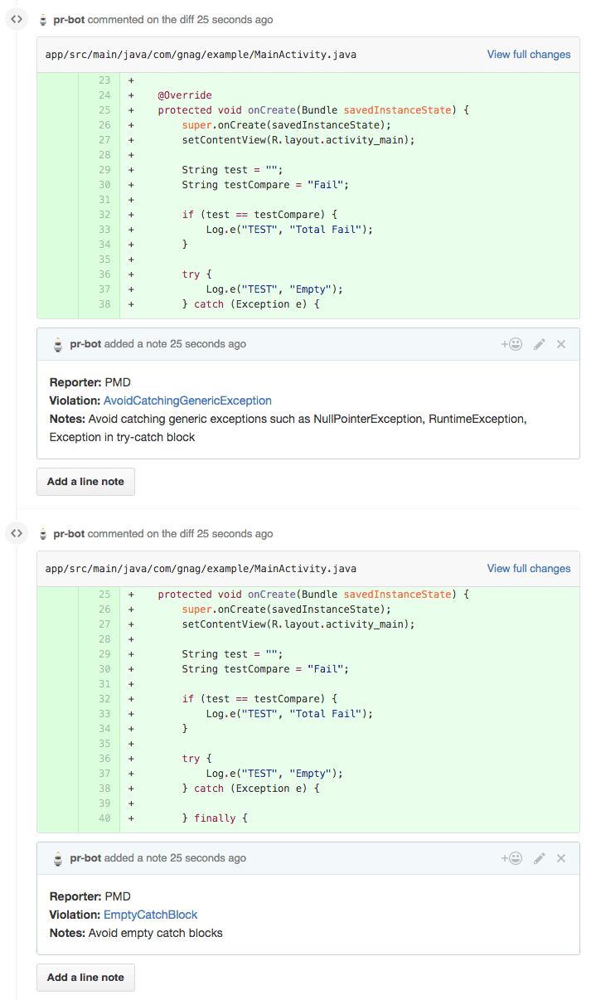
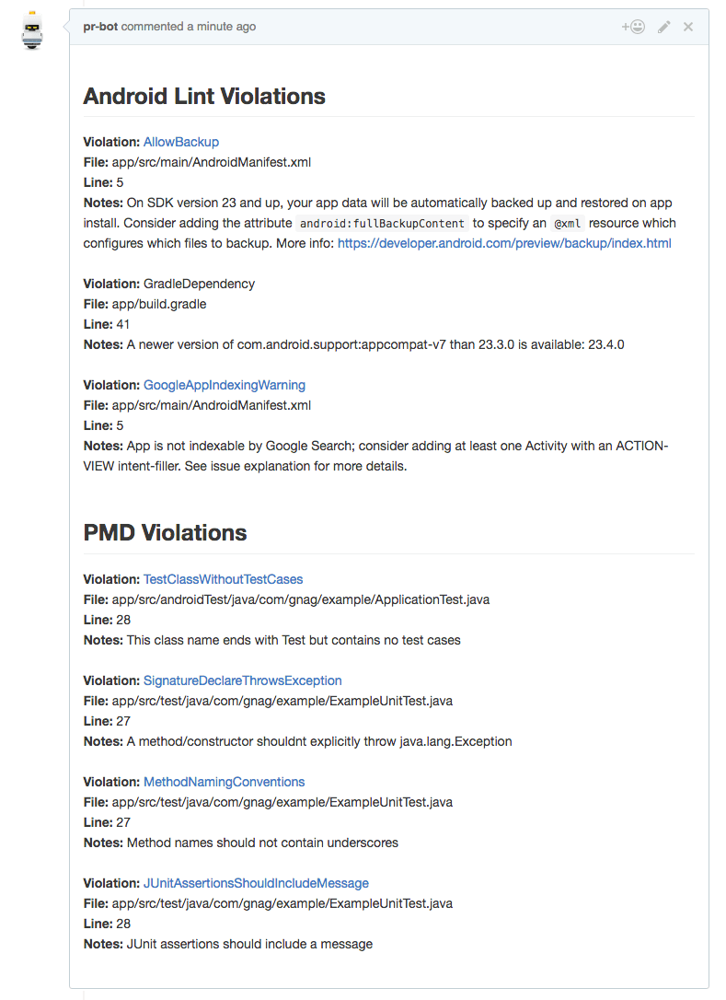

# Gnag <a href="https://travis-ci.org/btkelly/gnag"></a> [](https://coveralls.io/github/btkelly/gnag?branch=master) <a href="http://www.detroitlabs.com/"></a> <a href='https://bintray.com/btkelly/maven/gnag-gradle-plugin/_latestVersion'></a> [](https://android-arsenal.com/details/1/3128)
Gnag is a Gradle plugin that helps facilitate GitHub PR checking and automatic commenting of violations for Android projects.

It can be used in Java-only, Kotlin-only, and mixed Java/Kotlin codebases.

The name is a portmanteau of the words ["Gradle"](https://gradle.org/) and ["nag"](https://en.wiktionary.org/wiki/nag#Verb). The first "g" is silent!

## Usage

**Requires JDK 8**

Gnag is meant to be simple to use and easy to drop in to any Android project. Shown below is the simplest
Gnag setup that will report violations to GitHub. By default this config will report PMD, Findbugs, Checkstyle and
Android Lint to GitHub.

```groovy
buildscript {
    repositories {
        jcenter()
    }
    dependencies {
        classpath 'com.btkelly:gnag:{current version}'
    }
}

apply plugin: 'gnag'

gnag {
    github {
        repoName 'btkelly/repo'
        authToken '0000000000000'
        issueNumber '1'
    }
}
```

This is the simplest way to add automatic PR checking and commenting to your project. The options defined in the `github` closure can be overridden by passing command line parameters with the same name to your build. This is helpful when using in conjunction with a CI system to allow automated builds.

#### Tasks

You can use the gnagCheck gradle task to run Gnag locally and generate an HTML report in the build directory.
```groovy
./gradlew clean gnagCheck
```

You can use the gnagReport task which will first run gnagCheck and then report detected violations to the GitHub issue specified.
In this example the issue number and authtoken for the comment user are passed as commandline arguments.
```groovy
./gradlew clean gnagReport -PissueNumber=11 -PauthToken=iu2n3iu2nfjknfjk23nfkj23nk
```

#### Customization

```groovy
gnag {
    enabled true
    failOnError true
    
    checkstyle {
        enabled true
        reporterConfig project.file('config/checkstyle.xml')
    }
    
    pmd {
        enabled true
        reporterConfig project.file('config/pmd.xml')
    }
    
    findbugs {
        enabled true
        reporterConfig project.file('config/findbugs.xml')
    }
    
    ktlint {
        enabled true
    }
    
    detekt {
        enabled true
        reporterConfig project.file('config/detekt.yml')
    }
    
    androidLint {
        enabled true
        severity 'Error'
    }
    
    github {
        rootUrl 'https://my.githubinstall.com/repos/'
        repoName 'btkelly/repo'
        authToken '0000000000000'
        issueNumber '1'
    }
}
```

***NOTE:*** All reporters are enabled by default

- ***enabled*** - easily disable Gnag in specific situations
- ***failOnError*** - should violations cause the build to fail or just generate a report
- ***checkstyle*** - block to customize the checkstyle reporter
  - ***enabled*** - set if checkstyle should execute
  - ***reporterConfig*** - provide a custom [checkstyle config](http://checkstyle.sourceforge.net/config.html)
- ***pmd*** - block to customize the pmd reporter
  - ***enabled*** - set if pmd should execute
  - ***reporterConfig*** - provide a custom [pmd config](http://pmd.sourceforge.net/pmd-5.1.1/howtomakearuleset.html)
- ***findbugs*** - block to customize the findbugs reporter
  - ***enabled*** - set if findbugs should execute
  - ***reporterConfig*** - provide a custom [findbugs config](http://findbugs.sourceforge.net/manual/filter.html)
- ***ktlint*** - block to customize the ktlint reporter
  - ***enabled*** - set if ktlint should execute
- ***detekt*** - block to customize the detekt reporter
  - ***enabled*** - set if detekt should execute
  - ***reporterConfig*** - provide a custom [detekt config](https://arturbosch.github.io/detekt/configurations.html)
- ***androidLint*** - block to customize the android lint reporter
  - ***enabled*** - set if the android lint reporter should look for a lint report
  - ***severity*** - can be 'Error' or 'Warning' depending on which severity you want Gnag to check
- ***github*** - block to customize GitHub reporting (only used during the `gnagReport` task
  - ***rootUrl*** - root URL to use when communicating with the GitHub API (must include trailing slash), if not provided will default to "https://api.github.com/repos/"
  - ***repoName*** - account and repo name to report violations to
  - ***authToken*** - a GitHub token for a user that has access to comment on issues to the specified repo
  - ***issueNumber*** - the issue or PR number currently being built

## Example Output

Below are examples of output posted to a GitHub PR on a project using Gnag to enforce quality checks.

### Inline Comments

Violations associated with a specific line in your PR will be posted as comments on that line:



### Aggregated Comments

Violations that cannot be associated with a specific line in your PR will be aggregated and posted in a single top-level PR comment. This will include:

- violations associated with entire files or projects;
- violations detected by individual reporters with invalid file location information.



## Example [Travis CI](http://travis-ci.org) Usage

Travis is a continuous integration service and is free for open source projects. Below is an example of
 how to configure Gnag to run on Travis.

 You must set an environment variable on your Travis instance for the `PR_BOT_AUTH_TOKEN` used to post comments back to GitHub.

***.travis.yml***
```yml
language: android
android:
  components:
  - platform-tools
  - tools
  - build-tools-25.0.3
  - android-25
jdk:
  - oraclejdk8
branches:
  only:
  - master
script: "./travis-build.sh"
```

***travis-build.sh***
```bash
#!/bin/bash
set -ev

if [ "${TRAVIS_PULL_REQUEST}" = "false" ]; then
	./gradlew clean gnagCheck
else
	./gradlew clean gnagReport -PauthToken="${PR_BOT_AUTH_TOKEN}" -PissueNumber="${TRAVIS_PULL_REQUEST}"
fi
```

### License

    Copyright 2016 Bryan Kelly

    Licensed under the Apache License, Version 2.0 (the "License");
    you may not use this file except in compliance with the License.
    You may obtain a copy of the License at

       http://www.apache.org/licenses/LICENSE-2.0

    Unless required by applicable law or agreed to in writing, software
    distributed under the License is distributed on an "AS IS" BASIS,
    WITHOUT WARRANTIES OR CONDITIONS OF ANY KIND, either express or implied.
    See the License for the specific language governing permissions and
    limitations under the License.
